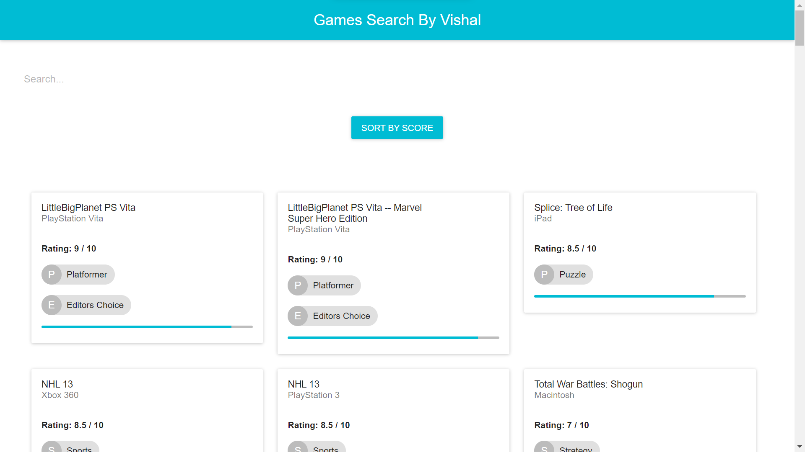
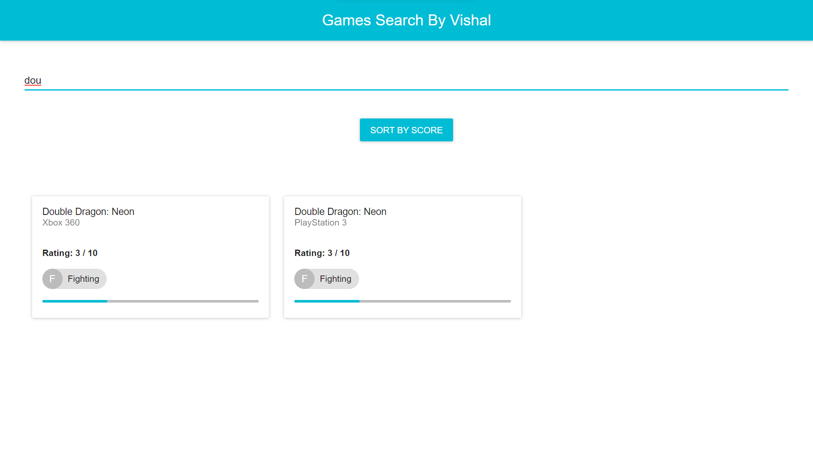
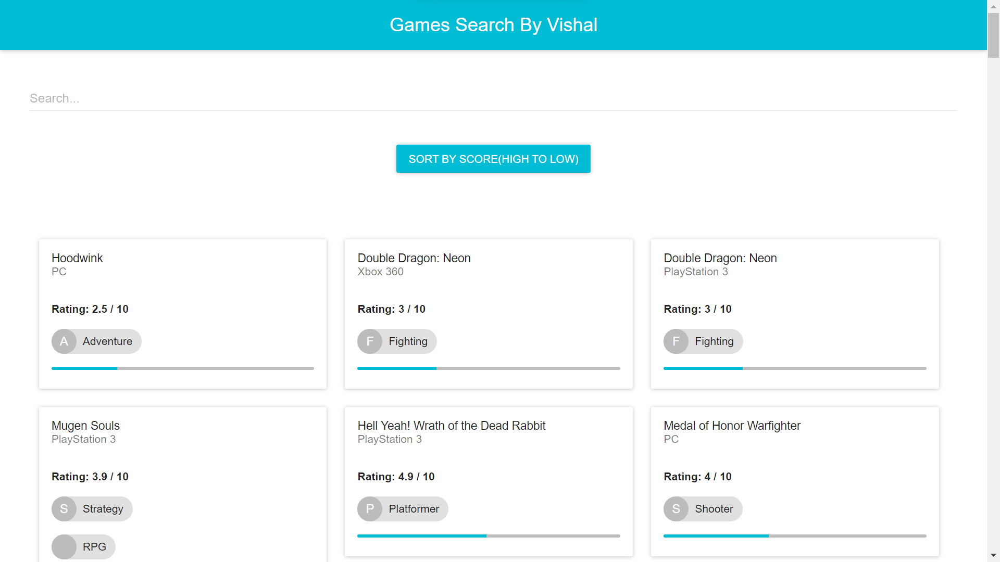
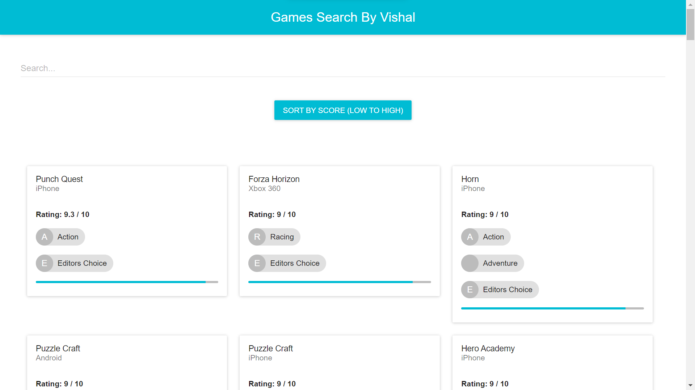
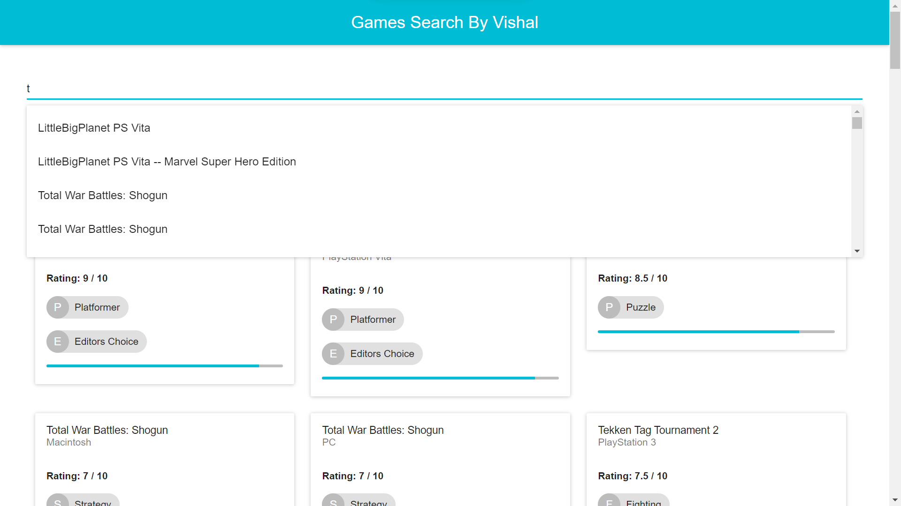
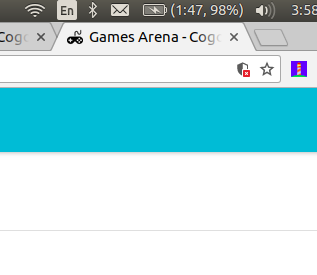
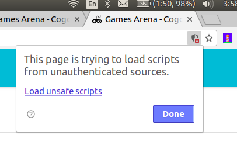

# Games-Search | Rentomojo Frontend Developer Hiring Challenge
Develop a front end application which would let the users help list and browse games
developed for different platforms conveniently.

## How to run the project online
Open the online demo [here]()

## Games API

- [Games API](https://s3-ap-southeast-1.amazonaws.com/he-public-data/gamesarena274f2bf.json)

## How to run the project in Development Mode
The project uses [Node.js >= 6.x](https://nodejs.org/en/) and the [Create-React-App starter code](https://github.com/facebookincubator/create-react-app).

After Node is installed in your system, follow the below steps.

1. Navigate to the directory where you want to store the app.
2. Clone the repo `git clone https://github.com/Vishal01-git/Games-Search`
3. Now install all modules listed as dependencies in `package.json` by running the command `npm install`
4. Launch the app with this command `npm start`

A new browser window open automatically displaying the app.  If it doesn't, navigate to [http://localhost:3000/](http://localhost:3000/) in your browser

## Screenshots
Project Home Page

Search Feature

Sort by score (Low to high)

Sort by score (high to low)

Suggestions

My website manishbisht.me is https only so click on load the unsafe scripts while checking the demo as the GAMES API is HTTP only.

